# 🏗️ Interactive Feedback MCP 架构与功能说明文档

> 本文档旨在帮助开发者快速理解项目的架构设计、功能逻辑和代码结构，以便更高效地进行二次开发和维护。

---

## 📋 目录

1. [项目概述](#项目概述)
2. [核心价值](#核心价值)
3. [项目蓝图](#项目蓝图)
4. [系统架构](#系统架构)
5. [核心模块说明](#核心模块说明)
6. [功能时序图](#功能时序图)
7. [类结构图](#类结构图)
8. [数据流图](#数据流图)
9. [技术栈](#技术栈)
10. [开发者快速入门](#开发者快速入门)

---

## 项目概述

**Interactive Feedback MCP** 是一个基于 MCP (Model Context Protocol) 的服务器，专为 AI 辅助开发工具（如 Cursor、Cline、Windsurf）设计。它实现了 **人机协作（Human-in-the-Loop）** 工作流程，允许 AI 在执行任务过程中暂停并向用户请求反馈或澄清。

### 核心理念

在传统的 AI 辅助开发中，每次与 LLM 的交互都被计为一个独立请求（如 Cursor 的 500 次/月限额）。当 AI 基于模糊指令猜测并生成错误代码时，用户需要多次纠正，导致请求浪费。

本项目通过 **工具调用（Tool Call）** 机制，让 AI 可以：
- 🤔 在不确定时主动询问用户
- 📝 在完成任务前请求确认
- 🔄 在单次请求中进行多轮交互

---

## 核心价值

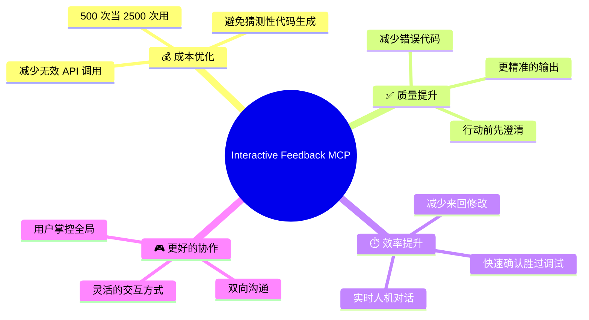

---

## 项目蓝图

### 生态位置图

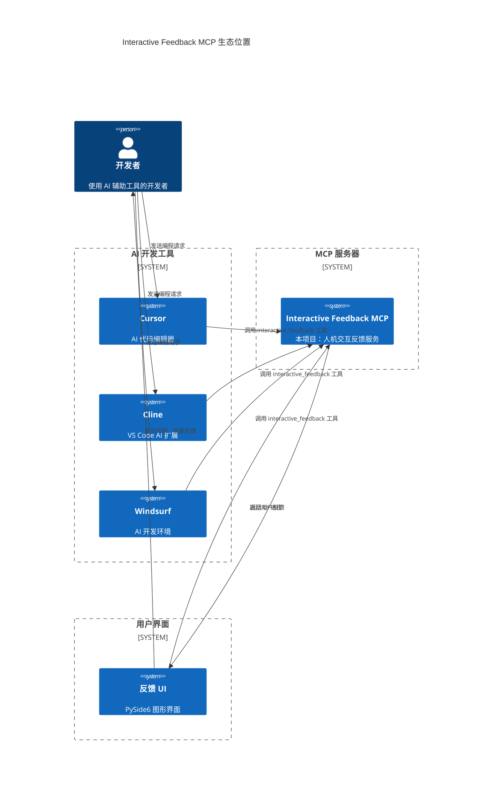

### 文件结构图

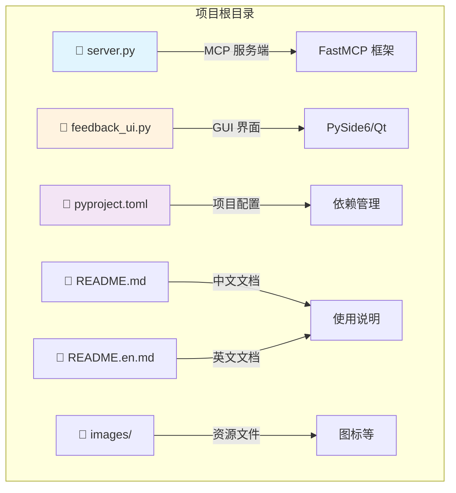

---

## 系统架构

### 三层架构图

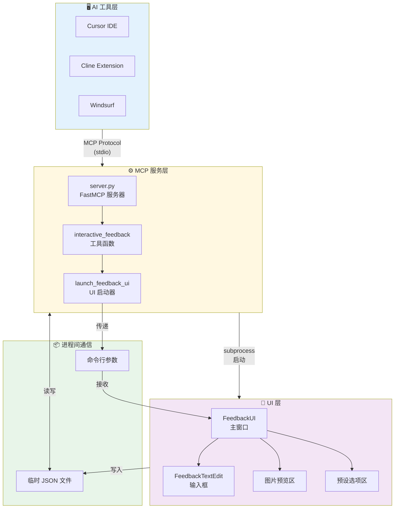

### 组件依赖图

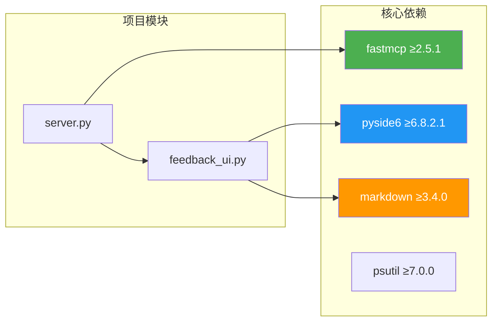

### 实例模式说明

本项目采用 **每个 AI 工具连接对应一个独立 Server 进程** 的单实例模式。

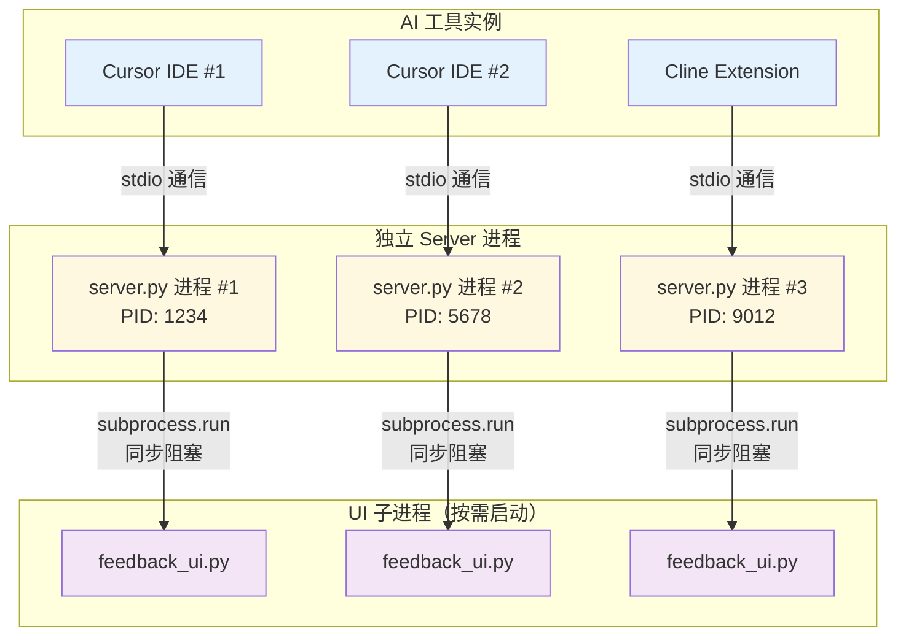

#### 关键特性

| 特性 | 说明 |
|------|------|
| **传输协议** | `stdio` - 标准输入输出流，每个客户端独立进程 |
| **进程模型** | 1:1 映射 - 每个 MCP 客户端启动独立的 `server.py` 进程 |
| **UI 启动方式** | `subprocess.run()` 同步阻塞，等待用户完成反馈 |
| **状态管理** | 无状态设计，每次工具调用独立处理 |
| **并发处理** | 单进程内串行，不同客户端并行（进程隔离） |

#### 设计优势

1. **简单可靠**：无需复杂的会话管理和状态同步
2. **资源隔离**：不同 AI 工具的反馈窗口互不干扰
3. **阻塞保证**：确保用户必须完成反馈后 AI 才继续执行
4. **故障隔离**：单个进程崩溃不影响其他客户端

#### 潜在扩展方向

如需支持多客户端共享单一 Server 实例，可考虑：
- 改用 HTTP/SSE 或 WebSocket 传输
- 实现会话 ID 管理
- 使用异步 UI 启动（`subprocess.Popen` + 回调）

---

## 核心模块说明

### server.py - MCP 服务端

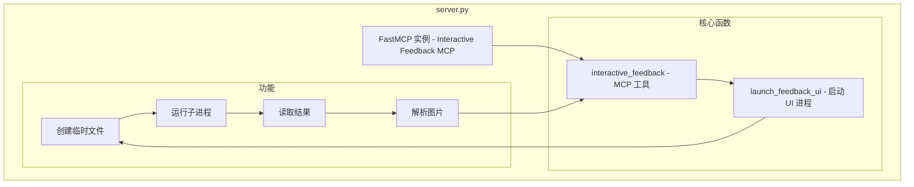

**核心流程说明：**

| 步骤 | 函数/操作 | 说明 |
|------|----------|------|
| 1 | `mcp = FastMCP()` | 初始化 MCP 服务器实例 |
| 2 | `@mcp.tool()` | 注册 `interactive_feedback` 工具 |
| 3 | `launch_feedback_ui()` | 创建临时 JSON 文件，启动 UI 子进程 |
| 4 | `subprocess.run()` | 以非阻塞方式运行 `feedback_ui.py` |
| 5 | 读取 JSON | 从临时文件读取用户反馈 |
| 6 | 返回结果 | 返回文本和/或 Image 对象 |

### feedback_ui.py - GUI 界面

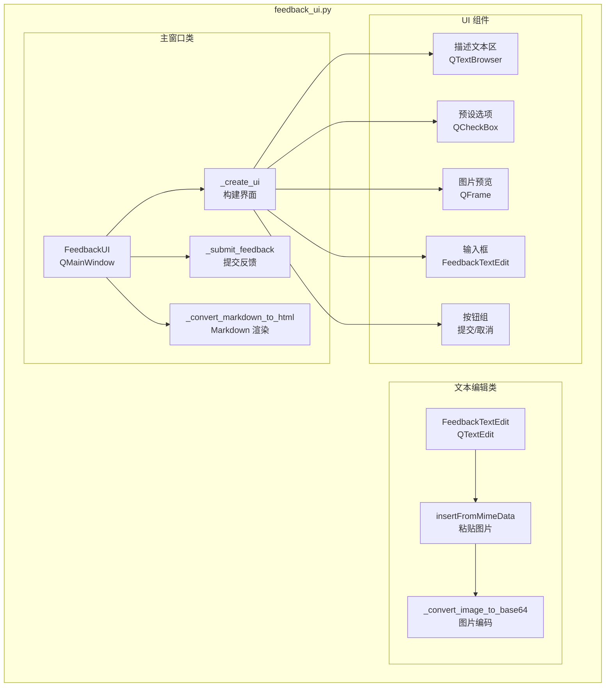

**核心功能说明：**

| 组件 | 功能 | 实现细节 |
|------|------|----------|
| **描述区** | 显示 AI 的问题/提示 | 自动检测 Markdown 并渲染，支持 Emoji |
| **预设选项** | 快速选择常用回答 | 复选框列表，可多选 |
| **图片预览** | 显示粘贴的图片 | 缩略图显示，支持删除 |
| **输入框** | 自由输入反馈 | 支持 Ctrl+Enter 提交，粘贴图片 |
| **快捷键** | 提升操作效率 | Ctrl+/-/0 字体缩放，Ctrl+Alt+H 行高 |

---

## 功能时序图

### 完整交互流程

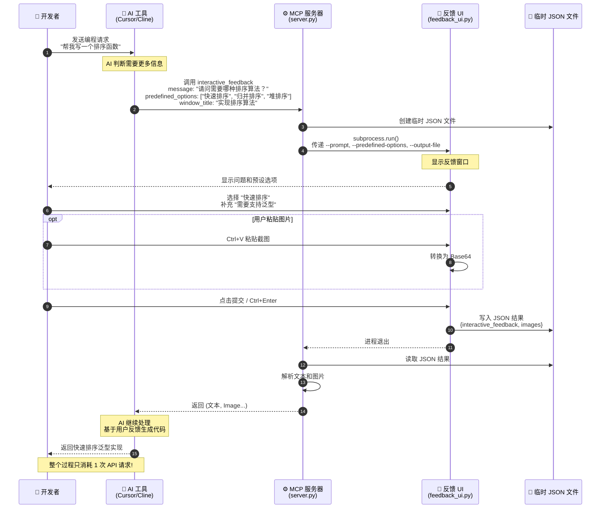

### 用户界面交互流程

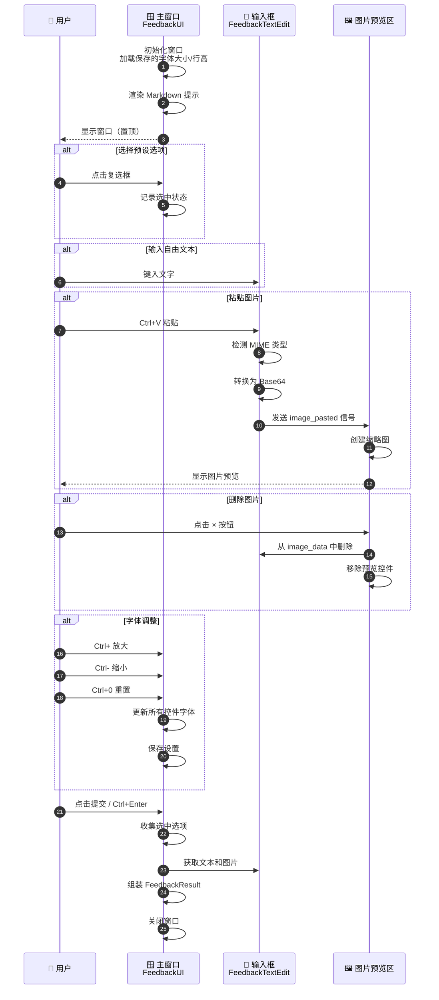

---

## 类结构图

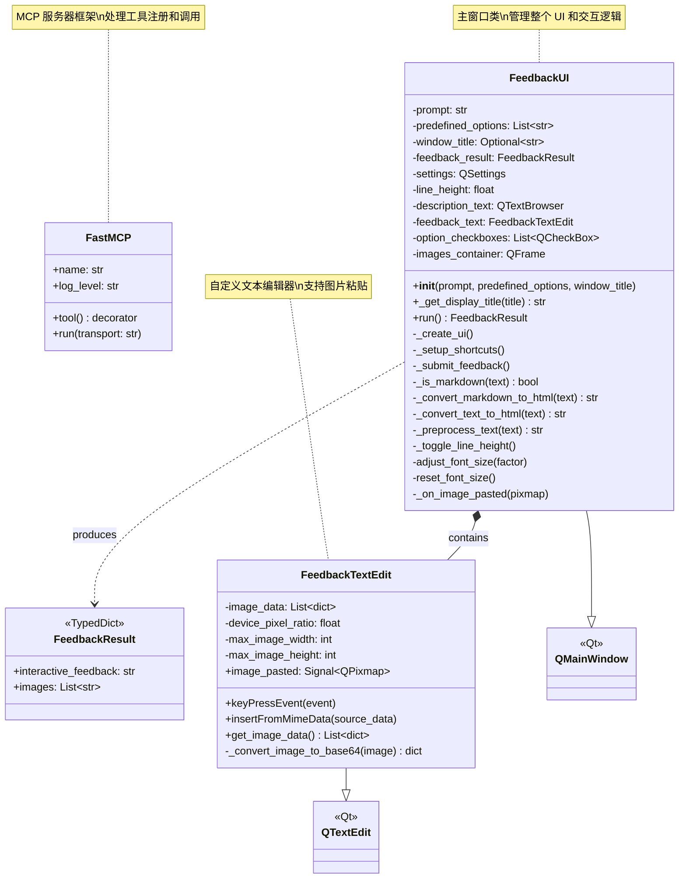

---

## 数据流图

### 输入数据流

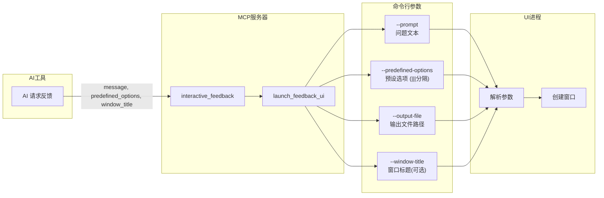

### 输出数据流

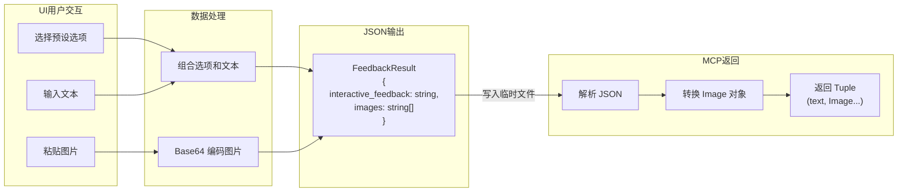

### 图片处理流程

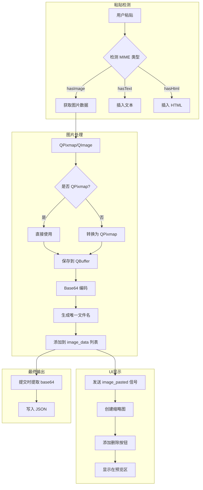

---

## 技术栈

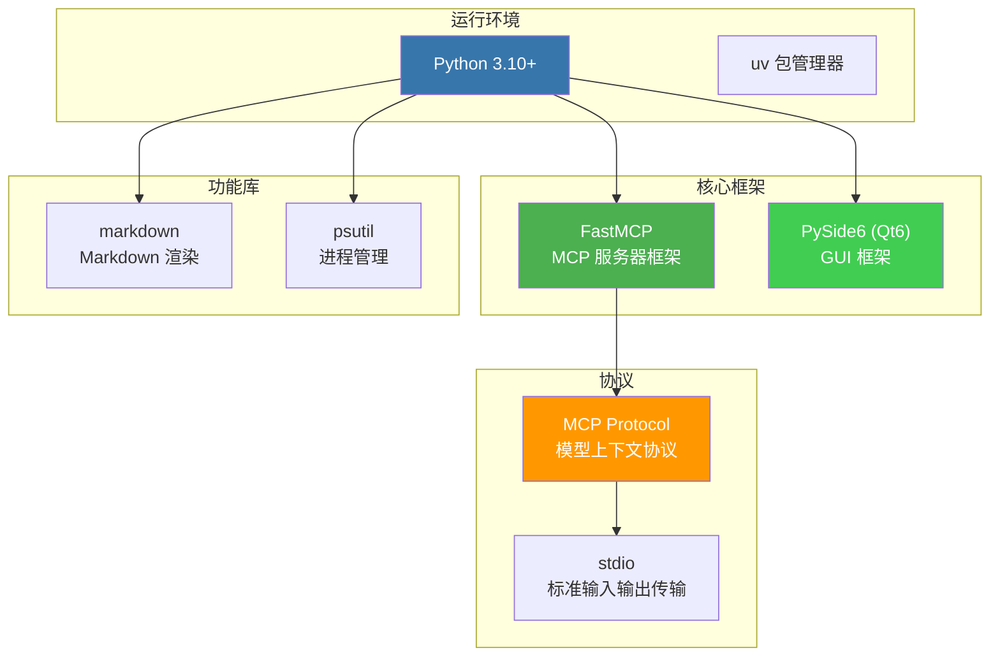

### 依赖版本要求

| 依赖包 | 最低版本 | 用途 |
|--------|----------|------|
| `fastmcp` | ≥2.5.1 | MCP 服务器框架 |
| `pyside6` | ≥6.8.2.1 | Qt6 GUI 框架 |
| `markdown` | ≥3.4.0 | Markdown 转 HTML |
| `psutil` | ≥7.0.0 | 进程信息获取 |

---

## 开发者快速入门

### 1. 环境准备

```bash
# 克隆仓库
git clone https://github.com/kele527/interactive-feedback-mcp.git
cd interactive-feedback-mcp

# 安装 uv（如果未安装）
pip install uv

# 安装依赖
uv sync
```

### 2. 本地测试 UI

```bash
# 直接运行 UI 测试
uv run python feedback_ui.py --prompt "这是一个测试问题" --predefined-options "选项1|||选项2|||选项3"
```

### 3. 配置 MCP 客户端

在 Cursor 的 `mcp.json` 或 Claude Desktop 的 `claude_desktop_config.json` 中添加：

```json
{
  "mcpServers": {
    "interactive-feedback": {
      "command": "uv",
      "args": ["--directory", "/your/path/to/interactive-feedback-mcp", "run", "server.py"],
      "timeout": 600,
      "autoApprove": ["interactive_feedback"]
    }
  }
}
```

### 4. 扩展开发指南

#### 添加新的 MCP 工具

```python
# 在 server.py 中添加
@mcp.tool()
def my_new_tool(
    param1: str = Field(description="参数1说明"),
    param2: int = Field(default=0, description="参数2说明"),
) -> str:
    """工具描述"""
    # 实现逻辑
    return "结果"
```

#### 自定义 UI 主题

```python
# 在 feedback_ui.py 中修改 get_dark_mode_palette 函数
def get_custom_palette(app: QApplication):
    palette = app.palette()
    palette.setColor(QPalette.Window, QColor(30, 30, 30))  # 背景色
    palette.setColor(QPalette.WindowText, Qt.white)        # 文字色
    # ... 更多自定义
    return palette
```

#### 添加新的快捷键

```python
# 在 FeedbackUI._setup_shortcuts 中添加
shortcut = QShortcut(QKeySequence("Ctrl+Shift+S"), self)
shortcut.activated.connect(self.my_custom_action)
```

---

## 🚀 多实例非阻塞改造方案

> 📄 **详细方案文档**: [MULTI_AGENT_PLAN.md](./MULTI_AGENT_PLAN.md)

当前架构采用阻塞式设计，不支持 Cursor 多 Agent 并发场景。为此，我们设计了一套非阻塞改造方案。

### 问题概述

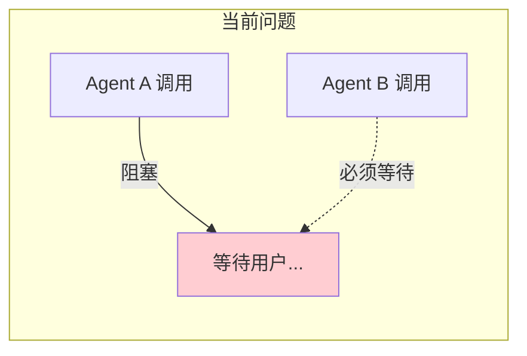

### 改造方向

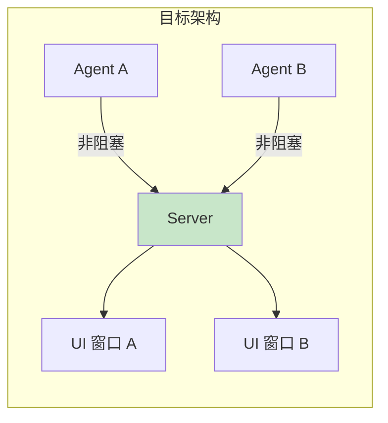

### 新增工具预览

| 工具 | 功能 | 说明 |
|------|------|------|
| `start_feedback` | 启动反馈 UI | 非阻塞，立即返回 request_id |
| `check_feedback` | 检查状态 | pending / completed / cancelled |
| `get_feedback` | 获取结果 | 返回文本和图片 |
| `cancel_feedback` | 取消请求 | 关闭 UI 窗口 |
| `list_pending_feedbacks` | 列出待处理 | 查看所有活跃请求 |

👉 **完整实施方案、代码示例、迁移指南请参阅 [MULTI_AGENT_PLAN.md](./MULTI_AGENT_PLAN.md)**

---

## 附录

### 工具参数说明

```
interactive_feedback(
    message: str,                    # 必填：显示给用户的问题或提示
    predefined_options: list = None, # 可选：预设选项列表，方便快速选择
    window_title: str = None         # 可选：反馈窗口标题，建议传入会话主题摘要（≤30字符）
) -> Tuple[str | Image, ...]
```

### 返回值格式

```python
# 仅文本
return "用户反馈文本"

# 仅图片
return (Image(data=bytes, format="png"),)

# 文本 + 图片
return ("用户反馈文本", Image(...), Image(...))

# 空反馈
return ("",)
```

### 常见问题

| 问题 | 解决方案 |
|------|----------|
| UI 不显示 | 检查 Python 环境和 PySide6 安装 |
| 中文乱码 | 确保系统支持中文字体 |
| 图片粘贴失败 | 检查剪贴板权限 |
| 工具调用超时 | 增加 `timeout` 配置值 |

---

*文档版本: 1.0.0 | 更新时间: 2025-01-05*

