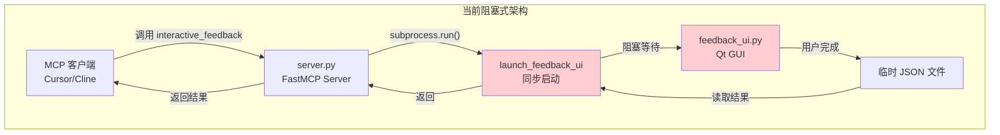
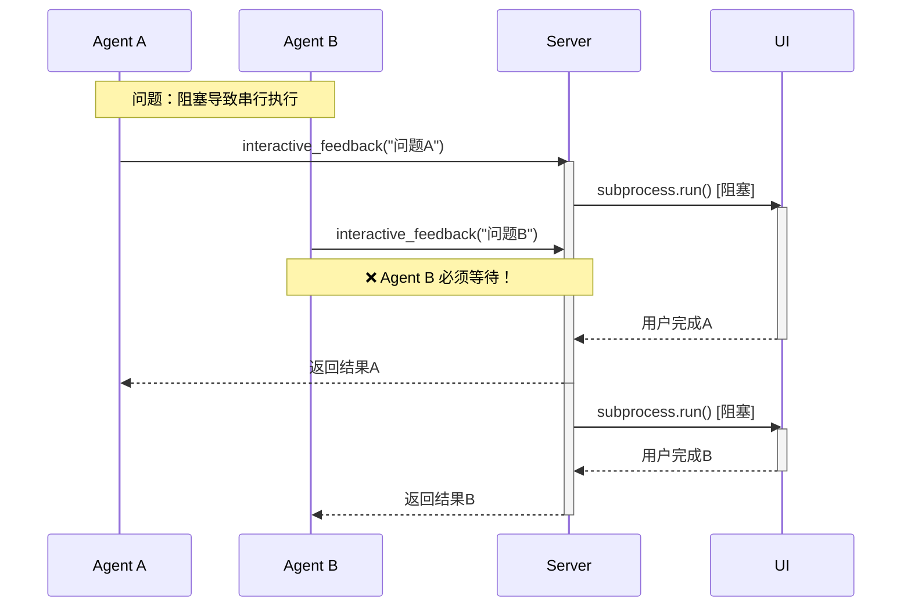
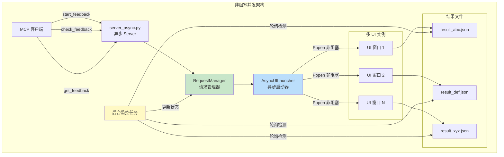
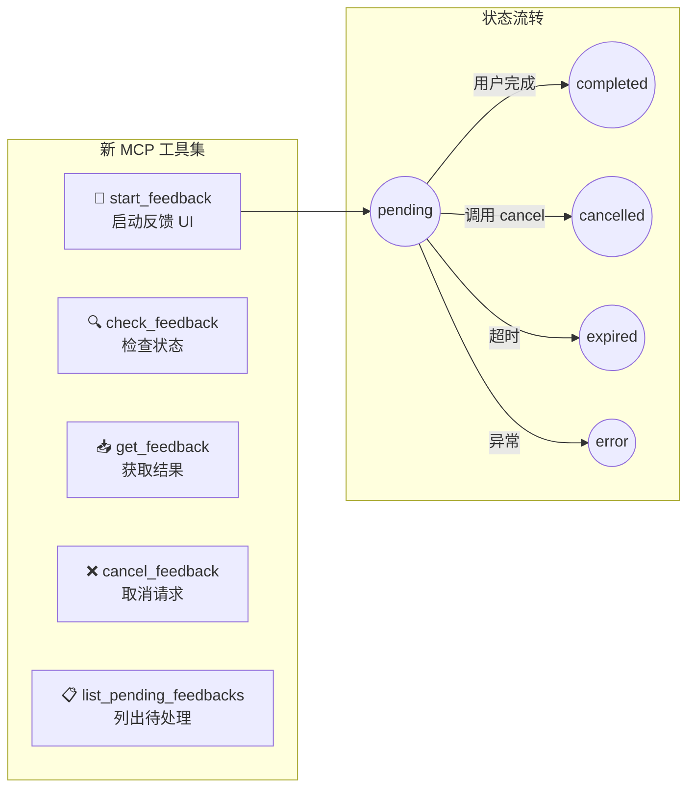
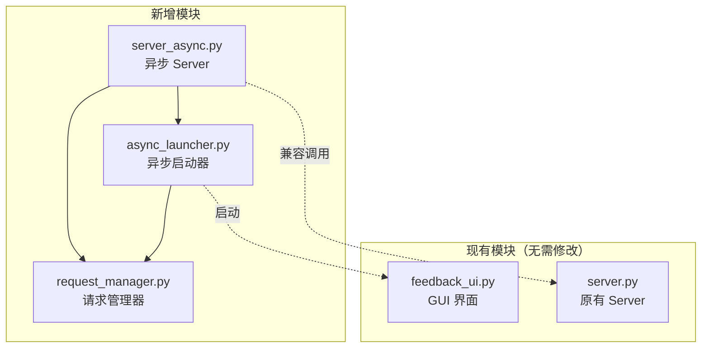
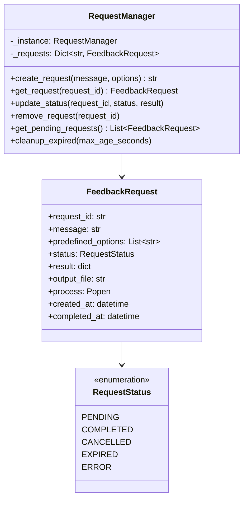
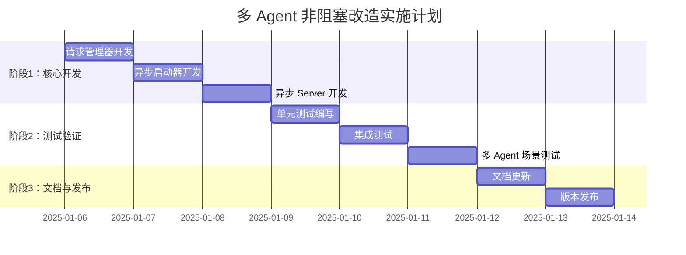

# 🚀 多 Agent 非阻塞模式改造方案

> **文档类型**: 技术改造方案 (Plan Mode)  
> **版本**: 1.0.0  
> **状态**: 待实施  
> **创建日期**: 2025-01-05

---

## 📋 目录

1. [背景与目标](#背景与目标)
2. [当前架构分析](#当前架构分析)
3. [目标架构设计](#目标架构设计)
4. [详细设计](#详细设计)
5. [实施计划](#实施计划)
6. [风险与应对](#风险与应对)
7. [验收标准](#验收标准)

---

## 背景与目标

### 背景

随着 Cursor 等 AI 开发工具支持多 Agent 并发执行，当前 Interactive Feedback MCP 的阻塞式设计成为瓶颈：

- **场景**: 用户在 Cursor 中同时启动多个 Agent 处理不同任务
- **问题**: 当 Agent A 调用 `interactive_feedback` 等待用户输入时，Agent B 的反馈请求被阻塞
- **影响**: 用户体验差，无法充分利用多 Agent 并发能力

### 目标

| 目标 | 描述 | 优先级 |
|------|------|--------|
| **非阻塞调用** | 反馈请求不阻塞 Server 进程 | P0 |
| **多窗口支持** | 支持同时显示多个反馈 UI 窗口 | P0 |
| **请求追踪** | 每个请求有唯一标识，可追踪状态 | P0 |
| **向后兼容** | 保留原有阻塞式工具，不影响现有用户 | P1 |
| **优雅取消** | 支持取消未完成的反馈请求 | P1 |
| **超时处理** | 自动清理过期请求 | P2 |

---

## 当前架构分析

### 现有架构图



### 问题分析



### 代码瓶颈定位

```python
# server.py - 第 40-48 行
result = subprocess.run(  # ⚠️ 同步阻塞调用
    args,
    check=False,
    shell=False,
    stdout=subprocess.DEVNULL,
    stderr=subprocess.DEVNULL,
    stdin=subprocess.DEVNULL,
    close_fds=True
)
# 在此处阻塞，直到 UI 进程退出
```

---

## 目标架构设计

### 架构概览



### 新工具设计



### 工具接口定义

| 工具名 | 参数 | 返回值 | 说明 |
|--------|------|--------|------|
| `start_feedback` | `message: str`<br/>`predefined_options?: list`<br/>`window_title?: str` | `feedback_started:{request_id}`<br/>或 `feedback_error:{msg}` | 非阻塞启动 UI |
| `check_feedback` | `request_id: str` | `status:{pending\|completed\|cancelled\|expired\|error}` | 检查请求状态 |
| `get_feedback` | `request_id: str` | 文本/图片元组 或 `error:{msg}` | 获取完成的结果 |
| `cancel_feedback` | `request_id: str` | `cancelled:{request_id}`<br/>或 `error:{msg}` | 取消请求 |
| `list_pending_feedbacks` | 无 | 待处理请求列表 | 查看所有待处理 |

---

## 详细设计

### 模块划分



### 1. 请求管理器 (`request_manager.py`)

#### 类图



#### 代码实现

```python
"""
request_manager.py - 请求管理器
职责：管理所有反馈请求的生命周期
"""
import uuid
from dataclasses import dataclass, field
from typing import Dict, Optional, List
from enum import Enum
from datetime import datetime
import subprocess


class RequestStatus(Enum):
    """请求状态枚举"""
    PENDING = "pending"       # 等待用户反馈
    COMPLETED = "completed"   # 用户已完成反馈
    CANCELLED = "cancelled"   # 请求已取消
    EXPIRED = "expired"       # 请求已过期
    ERROR = "error"           # 发生错误


@dataclass
class FeedbackRequest:
    """
    反馈请求数据类
    存储单个反馈请求的所有相关信息
    """
    request_id: str                                    # 唯一标识
    message: str                                       # 显示给用户的消息
    predefined_options: Optional[List[str]] = None    # 预设选项
    status: RequestStatus = RequestStatus.PENDING      # 当前状态
    result: Optional[dict] = None                      # 反馈结果
    output_file: str = ""                              # 输出文件路径
    process: Optional[subprocess.Popen] = None         # UI 进程引用
    created_at: datetime = field(default_factory=datetime.now)  # 创建时间
    completed_at: Optional[datetime] = None            # 完成时间


class RequestManager:
    """
    请求管理器（单例模式）
    负责：
    - 创建和存储请求
    - 状态更新
    - 过期清理
    """
    _instance = None
    
    def __new__(cls):
        """单例模式实现"""
        if cls._instance is None:
            cls._instance = super().__new__(cls)
            cls._instance._requests: Dict[str, FeedbackRequest] = {}
            cls._instance._lock = None  # 可选：线程锁
        return cls._instance
    
    def create_request(
        self, 
        message: str, 
        predefined_options: Optional[List[str]] = None
    ) -> str:
        """
        创建新的反馈请求
        
        Args:
            message: 显示给用户的问题/提示
            predefined_options: 预设选项列表
            
        Returns:
            request_id: 8位唯一标识符
        """
        request_id = str(uuid.uuid4())[:8]
        
        # 确保 ID 唯一（极小概率冲突）
        while request_id in self._requests:
            request_id = str(uuid.uuid4())[:8]
        
        request = FeedbackRequest(
            request_id=request_id,
            message=message,
            predefined_options=predefined_options
        )
        self._requests[request_id] = request
        
        return request_id
    
    def get_request(self, request_id: str) -> Optional[FeedbackRequest]:
        """获取请求对象"""
        return self._requests.get(request_id)
    
    def update_status(
        self, 
        request_id: str, 
        status: RequestStatus, 
        result: Optional[dict] = None
    ) -> bool:
        """
        更新请求状态
        
        Args:
            request_id: 请求 ID
            status: 新状态
            result: 反馈结果（可选）
            
        Returns:
            是否更新成功
        """
        if request_id not in self._requests:
            return False
            
        request = self._requests[request_id]
        request.status = status
        
        if result is not None:
            request.result = result
            
        if status == RequestStatus.COMPLETED:
            request.completed_at = datetime.now()
            
        return True
    
    def remove_request(self, request_id: str) -> bool:
        """移除请求（获取结果后调用）"""
        if request_id in self._requests:
            del self._requests[request_id]
            return True
        return False
    
    def get_pending_requests(self) -> List[FeedbackRequest]:
        """获取所有待处理的请求"""
        return [
            r for r in self._requests.values() 
            if r.status == RequestStatus.PENDING
        ]
    
    def get_all_requests(self) -> Dict[str, FeedbackRequest]:
        """获取所有请求（调试用）"""
        return self._requests.copy()
    
    def cleanup_expired(self, max_age_seconds: int = 3600) -> int:
        """
        清理过期请求
        
        Args:
            max_age_seconds: 最大存活时间（秒），默认1小时
            
        Returns:
            清理的请求数量
        """
        now = datetime.now()
        expired_ids = []
        
        for rid, req in self._requests.items():
            age = (now - req.created_at).total_seconds()
            if age > max_age_seconds and req.status == RequestStatus.PENDING:
                expired_ids.append(rid)
        
        for rid in expired_ids:
            self.update_status(rid, RequestStatus.EXPIRED)
            
        return len(expired_ids)
    
    def get_stats(self) -> dict:
        """获取统计信息"""
        stats = {
            "total": len(self._requests),
            "pending": 0,
            "completed": 0,
            "cancelled": 0,
            "expired": 0,
            "error": 0
        }
        for req in self._requests.values():
            stats[req.status.value] += 1
        return stats
```

### 2. 异步启动器 (`async_launcher.py`)

#### 流程图

```mermaid
flowchart TD
    Start[start_feedback_ui 被调用] --> CreateFile[创建临时输出文件]
    CreateFile --> BuildArgs[构建命令行参数]
    BuildArgs --> Popen["subprocess.Popen()<br/>非阻塞启动"]
    Popen --> SaveProcess[保存进程引用到 Request]
    SaveProcess --> CreateTask["asyncio.create_task()<br/>创建监控任务"]
    CreateTask --> Return[立即返回 True]
    
    subgraph "后台监控任务"
        Monitor[_monitor_process] --> Poll{process.poll()}
        Poll -->|"None (运行中)"| Sleep["await asyncio.sleep(0.5)"]
        Sleep --> Poll
        Poll -->|"退出码"| Check{检查退出码}
        Check -->|"0 且文件存在"| ReadResult[读取 JSON 结果]
        Check -->|"其他"| SetCancelled[设置 CANCELLED]
        ReadResult --> SetCompleted[设置 COMPLETED]
        SetCompleted --> Cleanup[清理临时文件]
        SetCancelled --> Cleanup
    end
    
    Return -.-> Monitor
```

#### 代码实现

```python
"""
async_launcher.py - 异步 UI 启动器
职责：非阻塞启动和监控 feedback_ui.py 进程
"""
import os
import sys
import json
import asyncio
import tempfile
import subprocess
from typing import Optional, List, Dict
from pathlib import Path

from request_manager import RequestManager, RequestStatus


class AsyncUILauncher:
    """
    异步 UI 启动器
    负责：
    - 非阻塞启动 UI 进程
    - 后台监控进程状态
    - 收集反馈结果
    """
    
    def __init__(self):
        self.manager = RequestManager()
        self.script_dir = Path(__file__).parent
        self.feedback_ui_path = self.script_dir / "feedback_ui.py"
        
        # 存储监控任务引用，便于取消
        self._monitor_tasks: Dict[str, asyncio.Task] = {}
        
        # 配置
        self.poll_interval = 0.5  # 轮询间隔（秒）
    
    async def start_feedback_ui(
        self,
        request_id: str,
        message: str,
        predefined_options: Optional[List[str]] = None,
        window_title: Optional[str] = None
    ) -> bool:
        """
        非阻塞启动反馈 UI
        
        Args:
            request_id: 请求 ID
            message: 显示给用户的消息
            predefined_options: 预设选项
            
        Returns:
            是否成功启动
        """
        # 1. 创建唯一的临时输出文件
        output_file = tempfile.NamedTemporaryFile(
            suffix=f"_{request_id}.json",
            prefix="feedback_",
            delete=False
        ).name
        
        # 2. 更新请求的输出文件路径
        request = self.manager.get_request(request_id)
        if request:
            request.output_file = output_file
        else:
            # 请求不存在
            os.unlink(output_file)
            return False
        
        # 3. 构建命令参数
        args = [
            sys.executable,
            "-u",  # 无缓冲输出
            str(self.feedback_ui_path),
            "--prompt", message,
            "--output-file", output_file,
            "--predefined-options", 
            "|||".join(predefined_options) if predefined_options else ""
        ]
        
        try:
            # 4. 非阻塞启动进程
            process = subprocess.Popen(
                args,
                stdout=subprocess.DEVNULL,
                stderr=subprocess.DEVNULL,
                stdin=subprocess.DEVNULL,
                # Windows 特殊处理
                creationflags=subprocess.CREATE_NO_WINDOW if sys.platform == "win32" else 0
            )
            
            # 5. 保存进程引用
            request.process = process
            
            # 6. 创建后台监控任务
            task = asyncio.create_task(
                self._monitor_process(request_id, process, output_file)
            )
            self._monitor_tasks[request_id] = task
            
            return True
            
        except Exception as e:
            # 启动失败
            self.manager.update_status(request_id, RequestStatus.ERROR)
            if os.path.exists(output_file):
                os.unlink(output_file)
            print(f"[AsyncUILauncher] 启动 UI 失败: {e}")
            return False
    
    async def _monitor_process(
        self, 
        request_id: str, 
        process: subprocess.Popen,
        output_file: str
    ):
        """
        后台监控进程状态
        
        在进程退出后读取结果并更新状态
        """
        try:
            # 轮询等待进程结束
            while process.poll() is None:
                await asyncio.sleep(self.poll_interval)
            
            # 进程已结束
            exit_code = process.returncode
            
            if exit_code == 0 and os.path.exists(output_file):
                # 正常退出，读取结果
                try:
                    with open(output_file, 'r', encoding='utf-8') as f:
                        result = json.load(f)
                    self.manager.update_status(
                        request_id, 
                        RequestStatus.COMPLETED, 
                        result
                    )
                except (json.JSONDecodeError, IOError) as e:
                    print(f"[AsyncUILauncher] 读取结果失败: {e}")
                    self.manager.update_status(request_id, RequestStatus.ERROR)
            else:
                # 非正常退出（用户关闭窗口等）
                self.manager.update_status(request_id, RequestStatus.CANCELLED)
                
        except asyncio.CancelledError:
            # 任务被取消
            self.manager.update_status(request_id, RequestStatus.CANCELLED)
            raise
            
        except Exception as e:
            print(f"[AsyncUILauncher] 监控异常: {e}")
            self.manager.update_status(request_id, RequestStatus.ERROR)
            
        finally:
            # 清理临时文件
            if os.path.exists(output_file):
                try:
                    os.unlink(output_file)
                except:
                    pass
            
            # 移除任务引用
            if request_id in self._monitor_tasks:
                del self._monitor_tasks[request_id]
    
    async def cancel_feedback(self, request_id: str) -> bool:
        """
        取消反馈请求
        
        Args:
            request_id: 要取消的请求 ID
            
        Returns:
            是否成功取消
        """
        request = self.manager.get_request(request_id)
        if not request:
            return False
        
        # 1. 终止 UI 进程
        if request.process and request.process.poll() is None:
            try:
                request.process.terminate()
                # 等待进程退出
                try:
                    request.process.wait(timeout=5)
                except subprocess.TimeoutExpired:
                    # 强制杀死
                    request.process.kill()
                    request.process.wait()
            except Exception as e:
                print(f"[AsyncUILauncher] 终止进程失败: {e}")
        
        # 2. 取消监控任务
        if request_id in self._monitor_tasks:
            task = self._monitor_tasks[request_id]
            if not task.done():
                task.cancel()
                try:
                    await task
                except asyncio.CancelledError:
                    pass
        
        # 3. 更新状态
        self.manager.update_status(request_id, RequestStatus.CANCELLED)
        
        # 4. 清理临时文件
        if request.output_file and os.path.exists(request.output_file):
            try:
                os.unlink(request.output_file)
            except:
                pass
        
        return True
    
    def get_active_count(self) -> int:
        """获取活跃的监控任务数量"""
        return len([t for t in self._monitor_tasks.values() if not t.done()])
```

### 3. 异步 Server (`server_async.py`)

#### 代码实现

```python
"""
server_async.py - 异步版 MCP Server
支持多 Agent 并发的非阻塞反馈
"""
import asyncio
import base64
from typing import Optional, List, Tuple, Union

from fastmcp import FastMCP, Image
from pydantic import Field

from request_manager import RequestManager, RequestStatus
from async_launcher import AsyncUILauncher


# 创建 MCP 实例
mcp = FastMCP("Interactive Feedback MCP (Async)", log_level="ERROR")

# 全局单例
manager = RequestManager()
launcher = AsyncUILauncher()


# ============================================================
# 新增异步工具
# ============================================================

@mcp.tool()
async def start_feedback(
    message: str = Field(description="显示给用户的问题或提示"),
    predefined_options: Optional[List[str]] = Field(
        default=None, 
        description="预设选项列表，方便用户快速选择（可选）"
    ),
    window_title: Optional[str] = Field(
        default=None,
        description="反馈窗口标题，建议传入当前会话的主题摘要（≤30字符）"
    ),
) -> str:
    """
    启动交互式反馈 UI（非阻塞）
    
    此工具会立即返回一个 request_id，不会等待用户完成输入。
    请使用 check_feedback 检查状态，使用 get_feedback 获取结果。
    
    Returns:
        - feedback_started:{request_id} - 成功启动
        - feedback_error:{message} - 启动失败
    """
    # 创建请求
    request_id = manager.create_request(message, predefined_options)
    
    # 异步启动 UI
    success = await launcher.start_feedback_ui(
        request_id, 
        message, 
        predefined_options
    )
    
    if success:
        return f"feedback_started:{request_id}"
    else:
        manager.remove_request(request_id)
        return "feedback_error:启动 UI 失败，请检查系统环境"


@mcp.tool()
def check_feedback(
    request_id: str = Field(description="反馈请求的 ID（由 start_feedback 返回）"),
) -> str:
    """
    检查反馈请求的状态
    
    Returns:
        - status:pending - 等待用户输入
        - status:completed - 用户已完成，可调用 get_feedback 获取结果
        - status:cancelled - 用户取消或窗口被关闭
        - status:expired - 请求已过期
        - status:error - 发生错误
        - error:请求不存在 - request_id 无效
    """
    request = manager.get_request(request_id)
    if not request:
        return "error:请求不存在"
    
    return f"status:{request.status.value}"


@mcp.tool()
def get_feedback(
    request_id: str = Field(description="反馈请求的 ID"),
) -> Union[Tuple[Union[str, Image], ...], str]:
    """
    获取已完成的反馈结果
    
    注意：必须在 check_feedback 返回 status:completed 后调用。
    调用后请求会被自动清理。
    
    Returns:
        - 成功：返回用户反馈文本和/或图片
        - 失败：返回 error:{message}
    """
    request = manager.get_request(request_id)
    if not request:
        return "error:请求不存在"
    
    if request.status != RequestStatus.COMPLETED:
        return f"error:请求尚未完成，当前状态: {request.status.value}"
    
    # 解析结果
    result = request.result or {}
    txt = result.get("interactive_feedback", "").strip()
    img_b64_list = result.get("images", [])
    
    # 转换图片
    images: List[Image] = []
    for b64 in img_b64_list:
        try:
            img_bytes = base64.b64decode(b64)
            images.append(Image(data=img_bytes, format="png"))
        except Exception:
            txt += "\n\n[warning] 有一张图片解码失败。"
    
    # 清理请求（防止内存泄漏）
    manager.remove_request(request_id)
    
    # 组装返回值
    if txt and images:
        return (txt, *images)
    elif txt:
        return txt
    elif images:
        return tuple(images) if len(images) > 1 else (images[0],)
    else:
        return ""


@mcp.tool()
async def cancel_feedback(
    request_id: str = Field(description="要取消的反馈请求 ID"),
) -> str:
    """
    取消正在进行的反馈请求
    
    会关闭对应的 UI 窗口并清理资源。
    
    Returns:
        - cancelled:{request_id} - 取消成功
        - error:{message} - 取消失败
    """
    request = manager.get_request(request_id)
    if not request:
        return "error:请求不存在"
    
    if request.status != RequestStatus.PENDING:
        return f"error:请求已结束，状态: {request.status.value}"
    
    success = await launcher.cancel_feedback(request_id)
    if success:
        return f"cancelled:{request_id}"
    else:
        return "error:取消失败"


@mcp.tool()
def list_pending_feedbacks() -> str:
    """
    列出所有待处理的反馈请求
    
    用于查看当前有哪些反馈正在等待用户输入。
    
    Returns:
        - no_pending_requests - 没有待处理的请求
        - 每行一个：{request_id}:{message前50字符}...
    """
    pending = manager.get_pending_requests()
    if not pending:
        return "no_pending_requests"
    
    lines = []
    for req in pending:
        msg_preview = req.message[:50] + "..." if len(req.message) > 50 else req.message
        lines.append(f"{req.request_id}:{msg_preview}")
    
    return "\n".join(lines)


# ============================================================
# 兼容工具（保留原有阻塞模式）
# ============================================================

@mcp.tool()
def interactive_feedback(
    message: str = Field(description="显示给用户的问题或提示"),
    predefined_options: Optional[List[str]] = Field(
        default=None,
        description="预设选项列表（可选）"
    ),
    window_title: Optional[str] = Field(
        default=None,
        description="反馈窗口标题，建议传入当前会话的主题摘要（≤30字符）"
    ),
) -> Union[Tuple[Union[str, Image], ...], str]:
    """
    [兼容模式] 阻塞式交互反馈
    
    ⚠️ 注意：此工具会阻塞直到用户完成反馈，不支持多 Agent 并发。
    建议使用 start_feedback + check_feedback + get_feedback 组合。
    """
    # 导入原有实现
    import sys
    import os
    sys.path.insert(0, os.path.dirname(__file__))
    from server import launch_feedback_ui
    
    result_dict = launch_feedback_ui(message, predefined_options, window_title)
    txt = result_dict.get("interactive_feedback", "").strip()
    img_b64_list = result_dict.get("images", [])
    
    images: List[Image] = []
    for b64 in img_b64_list:
        try:
            img_bytes = base64.b64decode(b64)
            images.append(Image(data=img_bytes, format="png"))
        except Exception:
            txt += "\n\n[warning] 有一张图片解码失败。"
    
    if txt and images:
        return (txt, *images)
    elif txt:
        return txt
    elif images:
        return tuple(images) if len(images) > 1 else (images[0],)
    else:
        return ""


# ============================================================
# 入口
# ============================================================

if __name__ == "__main__":
    mcp.run(transport="stdio")
```

---

## 实施计划

### 阶段划分



### 详细任务清单

| 阶段 | 任务 | 预计耗时 | 产出物 |
|------|------|----------|--------|
| **1.1** | 实现 `RequestManager` 类 | 2h | `request_manager.py` |
| **1.2** | 实现 `AsyncUILauncher` 类 | 3h | `async_launcher.py` |
| **1.3** | 实现异步 Server | 2h | `server_async.py` |
| **2.1** | 编写单元测试 | 2h | `test_request_manager.py`<br/>`test_async_launcher.py` |
| **2.2** | 编写集成测试 | 2h | `test_integration.py` |
| **2.3** | 多 Agent 场景测试 | 2h | 测试报告 |
| **3.1** | 更新 README | 1h | `README.md` 更新 |
| **3.2** | 更新架构文档 | 1h | `ARCHITECTURE.md` 更新 |
| **3.3** | 发布新版本 | 1h | v0.2.0 |

### 文件变更清单

```
interactive-feedback-mcp/
├── request_manager.py     # 新增
├── async_launcher.py      # 新增
├── server_async.py        # 新增
├── server.py              # 保持不变
├── feedback_ui.py         # 保持不变
├── pyproject.toml         # 更新版本号
├── README.md              # 更新使用说明
├── ARCHITECTURE.md        # 更新架构说明
└── tests/                 # 新增
    ├── test_request_manager.py
    ├── test_async_launcher.py
    └── test_integration.py
```

---

## 风险与应对

| 风险 | 可能性 | 影响 | 应对措施 |
|------|--------|------|----------|
| **FastMCP 异步兼容性** | 中 | 高 | 提前测试 FastMCP 的异步工具支持 |
| **Windows 进程管理差异** | 中 | 中 | 添加 Windows 特定处理逻辑 |
| **内存泄漏** | 低 | 高 | 实现过期清理机制，设置最大请求数 |
| **用户习惯改变** | 中 | 中 | 保留兼容工具，提供迁移指南 |
| **多窗口 UI 冲突** | 低 | 低 | 每个窗口独立进程，互不影响 |

---

## 验收标准

### 功能验收

- [ ] `start_feedback` 能在 100ms 内返回
- [ ] 支持同时启动 5 个以上反馈窗口
- [ ] `check_feedback` 正确返回各状态
- [ ] `get_feedback` 正确返回文本和图片
- [ ] `cancel_feedback` 能正确关闭窗口
- [ ] 原有 `interactive_feedback` 工具正常工作

### 性能验收

- [ ] 单次 `start_feedback` 调用耗时 < 200ms
- [ ] 100 个并发请求不导致内存异常增长
- [ ] 过期清理正常工作

### 兼容性验收

- [ ] Windows 10/11 正常工作
- [ ] macOS 正常工作
- [ ] Linux (Ubuntu) 正常工作
- [ ] Cursor 多 Agent 场景正常工作

---

## 附录

### A. 配置示例

```json
{
  "mcpServers": {
    "interactive-feedback-async": {
      "command": "uv",
      "args": [
        "--directory", 
        "/path/to/interactive-feedback-mcp", 
        "run", 
        "server_async.py"
      ],
      "timeout": 600,
      "autoApprove": [
        "start_feedback",
        "check_feedback", 
        "get_feedback",
        "cancel_feedback",
        "list_pending_feedbacks",
        "interactive_feedback"
      ]
    }
  }
}
```

### B. Agent 调用示例

```python
# 伪代码：Agent 使用新工具的流程

# 1. 启动反馈
result = call_tool("start_feedback", {
    "message": "请确认要使用哪种排序算法？",
    "predefined_options": ["快速排序", "归并排序", "堆排序"],
    "window_title": "实现排序算法"
})
# result = "feedback_started:abc123"
request_id = result.split(":")[1]

# 2. 继续执行其他任务...
do_other_work()

# 3. 检查反馈状态
while True:
    status = call_tool("check_feedback", {"request_id": request_id})
    if "completed" in status:
        break
    elif "pending" in status:
        await asyncio.sleep(1)
    else:
        # cancelled, expired, error
        handle_error(status)
        break

# 4. 获取结果
feedback = call_tool("get_feedback", {"request_id": request_id})
process_feedback(feedback)
```

### C. 迁移对照表

| 原工具调用 | 新工具调用 |
|-----------|-----------|
| `interactive_feedback(msg)` | `start_feedback(msg)` → `check_feedback(id)` → `get_feedback(id)` |
| 无 | `cancel_feedback(id)` |
| 无 | `list_pending_feedbacks()` |

---

*文档版本: 1.0.0 | 创建日期: 2025-01-05 | 状态: 待实施*

